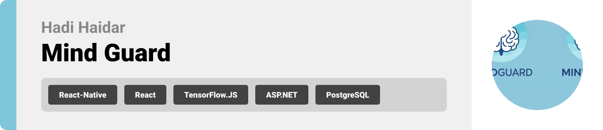
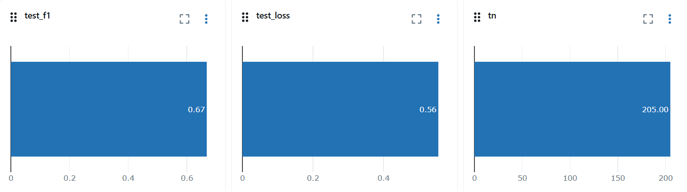

  

<!-- project overview -->

> MindGuard is a wellness and AI-powered platform that tracks daily mood patterns and personal habits.
> It analyzes journal entries, behaviors, and trends to predict emotional states up to 48 hours ahead, providing personalized insights for better self-awareness and mental resilience.

> The app collects and organizes user data, processes it through AI models, and allows users to generate tailored reports that highlight risks, suggest coping strategies, and support proactive mental health management.

  

<!-- System Design -->

### ER Diagram

<a href="https://app.eraser.io/workspace/KwPAEJ6ihtTdqEIWptbE?origin=share">Eraser Link</a>

### Component Diagram

  

<!-- Project Highlights -->

### The Journey of the Sexy Features

- Seamless Calendar Syncing: The platform integrates with personal calendars to align daily schedules with mood predictions, helping users plan activities at times when they are most likely to feel energized and focused.

- End-to-End MLflow Tracking: Every machine learning experiment, model version, and deployment is automatically tracked with MLflow, ensuring reproducibility, transparency, and continuous improvement of predictive insights.

- Autonomous AI Agent: A robust AI agent analyzes journal entries and behavioral signals, delivering real-time mood assessments, personalized recommendations, and early risk detection for better mental health management.

- Predictive ML Modeling: Advanced machine learning models process historical mood and habit data to forecast emotional states up to 48 hours ahead, empowering users with foresight into their mental well-being.

- Automated n8n Workflows: Integrated with n8n, the system automates data pipelines and report generation—streamlining routine tasks, sending timely alerts, and connecting MindGuard to external services with minimal effort.

### Feature Diagram

  

<!-- Demo -->

### User Screens (Mobile)

| Landing screen                            | Login screen                          | Register screen                             |
| ----------------------------------------- | ------------------------------------- | ------------------------------------------- |
|  |  |  |

| Home screen                         | Journal and Insight Screens        | Mood Map screen                   |
| ----------------------------------- | ---------------------------------- | --------------------------------- |
|  |  |  |

| Routine screen                                  | Profile screen                            | Dark Mode                       |
| ----------------------------------------------- | ----------------------------------------- | ------------------------------- |
|  |  |  |

### Admin Screens (Web)

| Landing screen                        |
| ------------------------------------- |
|  |

### Automation Workflow

| N8N Workflow                       | N8N Workflow                             |
| ---------------------------------- | ---------------------------------------- |
|  |  |

### MLFlow

| MLFlow UI                                |
| ---------------------------------------- |
|  |

  

<!-- Development & Testing -->

### Services

| Service                               |
| ------------------------------------- |
|  |

### Validation

| Validation                                  |
| ------------------------------------------- |
|  |

### Testing

| Test Case                           | Test Case                           |
| ----------------------------------- | ----------------------------------- |
|  |  |

### Linear

| Linear Workflow                             |
| ------------------------------------------- |
|  |

### Pull Requests

| Frontend CI                        | Backend CI                        |
| ---------------------------------- | --------------------------------- |
|  |  |

### AI Agent – Process Flow

1. **User Writing** – The user writes a diary note describing their feelings.
2. **Memory Check** – The system checks whether this entry has been analyzed before.
3. **AI Analysis** – The text is sent to Gemini, requesting only two outputs:
   - Mood (e.g., happy, sad, stressed).
   - Sentiment score (–5 very negative → +5 very positive).
4. **Validation** – Gemini’s response is validated for clarity and consistency.
5. **Common Sense Adjustment** – The system scans for strong keywords (e.g., “panic”, “joy”) and adjusts the mood if necessary.
6. **Final Decision** – Combines AI prediction and keyword check to produce the final result.
7. **Result Returned** – A clean output is shown:
   - Mood: Stressed
   - Score: –3

### ML Dataset

Our dataset combines **public corpora** (mood annotated texts) with **synthetic but realistic entries** generated through app journaling simulations.

**Steps followed to build the dataset:**

1. **Data Collection** – Gathered mood-labelled text samples and generated journal-style entries to simulate real usage.
2. **Cleaning** – Removed duplicates, normalized casing, and stripped special characters.
3. **Feature Engineering** – Extracted two key signals:
   - Mood category (one of 11 moods: anxiety, stress, happy, calm, etc.).
   - Sentiment score (–5 to +5).
4. **Versioning**:
   - **Tabular Dataset (V1):** Single-entry prediction of LOW/MEDIUM/HIGH risk.
   - **Sequence Dataset (V2):** Past 7 days → predict next 48h as AT_RISK or OK.
5. **Balancing** – Applied class weighting during training to handle label imbalance.

⚠️ _Note: No personal or raw journal text is used only mood categories, sentiment scores, and timestamps. Labels are derived from proxy rules. This ensures privacy and ethical use of data._

### 📊 ML Metrics

We evaluated our **sequence based mood risk prediction model** on a held out test set.

- **Accuracy:** ~69%
- **F1 Score:** ~67%
- **Loss:** 0.56

**Confusion Matrix Highlights**

- **TN = 205** → Non risk days correctly predicted as safe.
- **FP = 21** → Safe days incorrectly flagged as risk.
- **FN = 165** → Risk days incorrectly predicted as safe.

> **Insight:** The model performs fairly well (~69% accuracy) but shows higher false negatives (missed risk days). This will be improved in the next iterations through more balanced training data, threshold tuning, and enhanced feature engineering.

#### Metrics Visualizations

| Metrics 1                                | Metrics 2                                |
| ---------------------------------------- | ---------------------------------------- |
|  |  |

| Metrics 3                                |
| ---------------------------------------- |
|  |

  

<!-- Deployment -->

### Swagger

- Testing Apis responses using swagger and ensuring their optimization.

| Swagger APIS                               | Swagger Docs                               |
| ------------------------------------------ | ------------------------------------------ |
|  |  |

### Deployment Map

| Deployment Map                          |
| --------------------------------------- |
|  |

  
