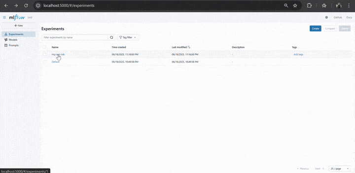

  

<!-- project overview -->

> MindGuard is a wellness and AI-powered platform that tracks daily mood patterns and personal habits.
> It analyzes journal entries, behaviors, and trends to predict emotional states up to 48 hours ahead, providing personalized insights for better self-awareness and mental resilience.

> The app collects and organizes user data, processes it through AI models, and allows users to generate tailored reports that highlight risks, suggest coping strategies, and support proactive mental health management.

  

<!-- System Design -->

### ER Diagram

- 

### Component Diagram

- 

  

<!-- Project Highlights -->

### The Journey of the Sexy Features

- Seamless Calendar Syncing: The platform integrates with personal calendars to align daily schedules with mood predictions, helping users plan activities at times when they are most likely to feel energized and focused.

- End-to-End MLflow Tracking: Every machine learning experiment, model version, and deployment is automatically tracked with MLflow, ensuring reproducibility, transparency, and continuous improvement of predictive insights.

- Autonomous AI Agent: A robust AI agent analyzes journal entries and behavioral signals, delivering real-time mood assessments, personalized recommendations, and early risk detection for better mental health management.

- Predictive ML Modeling: Advanced machine learning models process historical mood and habit data to forecast emotional states up to 48 hours ahead, empowering users with foresight into their mental well-being.

- Automated n8n Workflows: Integrated with n8n, the system automates data pipelines and report generation—streamlining routine tasks, sending timely alerts, and connecting MindGuard to external services with minimal effort.

### Feature Diagram

  

<!-- Demo -->

### User Screens (Mobile)

| Landing screen                            | Login screen                          | Register screen                             |
| ----------------------------------------- | ------------------------------------- | ------------------------------------------- |
|  |  |  |

| Home screen                         | Journal and Insight Screens           | Mood Map screen                   |
| ----------------------------------- | ------------------------------------- | --------------------------------- |
|  |  |  |

| Routine screen                                          | Profile screen                            | Dark Mode                           |
| ------------------------------------------------------- | ----------------------------------------- | ----------------------------------- |
|  |  |  |

### Admin Screens (Web)

| Landing screen                        |
| ------------------------------------- |
|  |

### Automation Workflow

| N8N Workflow                       | N8N Workflow                             |
| ---------------------------------- | ---------------------------------------- |
|  |  |

### MLFlow

| MLFlow UI                                |
| ---------------------------------------- |
|  |

  

<!-- Development & Testing -->

### Services

| Service                               |
| ------------------------------------- |
|  |

### Validation

| Validation                                  |
| ------------------------------------------- |
|  |

### Testing

| Test Case                           | Test Case                           |
| ----------------------------------- | ----------------------------------- |
|  |  |

### Linear

| Linear Workflow                             |
| ------------------------------------------- |
|  |

### Pull Requests

| Frontend CI                        | Backend CI                        |
| ---------------------------------- | --------------------------------- |
|  |  |

### Swagger

- Testing Apis responses using swagger and ensuring their optimization.

| Swagger APIS                               | Swagger Docs                               |
| ------------------------------------------ | ------------------------------------------ |
|  |  |

### AI AGENT

1. Input (the diary entry)

A person writes a short diary note, maybe “I failed my exam and feel hopeless” or “Had a great day with friends, feeling grateful.”

That text is sent into the system.

2. First Check: Is this new?

The agent first checks its “memory.”

If it has already seen this exact note before, it reuses the same result (to stay consistent).

If it’s new, the agent continues.

3. Ask the AI Model (Gemini)

The agent sends the text to Google Gemini.

But instead of letting Gemini answer freely, the agent gives it strict rules:

Only reply in a very specific format.

Pick one mood from a fixed list (happy, sad, anxious, angry, stressed, calm, neutral).

Give a sentiment score from –5 (very negative) to +5 (very positive).

This is like asking Gemini:
👉 “Don’t give me a paragraph, just fill in this form: {mood: **_, score: _**}.”

4. Validate & Clean the Answer

Sometimes AI tries to be creative or makes mistakes.

So the agent double-checks the answer:

Is the mood on the allowed list?

Is the score a number between –5 and +5?

If not, the agent fixes it or asks again.

5. Add Extra Common Sense (Heuristics)

The agent doesn’t rely on Gemini alone.

It scans the text with keyword lists:

Words like “panic,” “deadline,” or “exam” push the mood toward stressed.

Words like “grateful,” “joy,” or “calm” push it toward happy or calm.

Serious words like “suicidal” or “no reason to live” trigger a stronger negative result (sad, score closer to –5).

This ensures the system doesn’t wrongly call very negative text “neutral.”

6. Final Decision

The agent combines Gemini’s answer with its own keyword checks.

If Gemini said “neutral” but the text is clearly sad or stressed, the agent overrides it.

The result is a fair, consistent judgment:

Example: “stressed, –3” or “happy, +2.”

7. Output

The agent gives back a simple, clear result:

{ "mood": "stressed", "sentiment_score": -3 }

This output can then be used by the rest of your app — for tracking mood trends, building charts, or giving gentle guidance.

### ML Dataset

This project uses data collected from two main sources:

Public and custom text datasets — Large-scale text samples with emotion or mood annotations (for example, datasets inspired by GoEmotions and our own curated mood-labeled text). These were normalized into a consistent set of 11 moods: anxiety, sadness, anger, fear, shame, stress, lonely, calm, happy, excited, and confused. Sentiment scores (ranging from negative to positive) were also calculated.

App journal data — Realistic user journaling history stored in the application database. Each entry includes a mood, a sentiment score, and timestamps. By combining multiple days of entries, we generate sequences of user history.

V1 — Tabular Dataset

The first dataset focuses on predicting risk level (LOW, MEDIUM, HIGH) from a single entry. Each row includes:

A mood label

A sentiment score

A weakly derived risk level, based on the mood and sentiment combination

This dataset was mainly used for baseline experiments and quick model testing.

V2 — Sequence Dataset

The second dataset captures 7-day windows of user moods and sentiment scores to predict whether the next 48 hours will be at risk. Each sequence includes:

Aggregate features (average sentiment, trends)

Distribution of moods across the last 7 days

The most recent mood

A label (AT_RISK or OK) based on whether the upcoming 48 hours showed negative patterns

This dataset better reflects the real user experience: instead of judging a single entry, it looks at a history of moods to make forward-looking predictions.

Ethics and Quality

Privacy: Only aggregated mood and sentiment scores are used for training. No personal identifying information or raw journal text is included.

Weak Labels: Risk labels are based on proxy rules, not medical diagnoses. These rules are documented and can be refined later.

Balance: Because moods and risk levels are imbalanced, we applied weighting during training to avoid bias.

### ML Metrics

| ML Metrics                              |
| --------------------------------------- |
|  |
|  |
|  |

  

<!-- Deployment -->

### Deployment Map

| Deployment Map                                 |
| ---------------------------------------------- |
|  |

  
