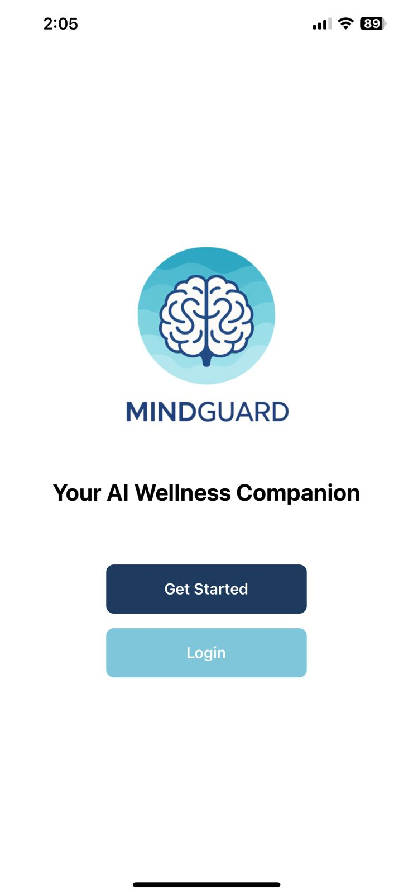

  

<!-- project overview -->

> MindGuard is a wellness and AI-powered platform that tracks daily mood patterns and personal habits.
> It analyzes journal entries, behaviors, and trends to predict emotional states up to 48 hours ahead, providing personalized insights for better self-awareness and mental resilience.

> The app collects and organizes user data, processes it through AI models, and allows users to generate tailored reports that highlight risks, suggest coping strategies, and support proactive mental health management.

  

<!-- System Design -->

### ER Diagram

- 

### Component Diagram

- 

  

<!-- Project Highlights -->

### The Journey of the Sexy Features

- Seamless Calendar Syncing: The platform integrates with personal calendars to align daily schedules with mood predictions, helping users plan activities at times when they are most likely to feel energized and focused.

- End-to-End MLflow Tracking: Every machine learning experiment, model version, and deployment is automatically tracked with MLflow, ensuring reproducibility, transparency, and continuous improvement of predictive insights.

- Autonomous AI Agent: A robust AI agent analyzes journal entries and behavioral signals, delivering real-time mood assessments, personalized recommendations, and early risk detection for better mental health management.

- Predictive ML Modeling: Advanced machine learning models process historical mood and habit data to forecast emotional states up to 48 hours ahead, empowering users with foresight into their mental well-being.

- Automated n8n Workflows: Integrated with n8n, the system automates data pipelines and report generation—streamlining routine tasks, sending timely alerts, and connecting MindGuard to external services with minimal effort.

### Feature Diagram

  

<!-- Demo -->

### User Screens (Mobile)

| Landing screen      | Login screen         | Register screen    |
| ------------------- | -------------------- | ------------------ |
||||
|Home screen                        |Journal and Insight Screens          |Mood Map screen                  |
||||
| Routine screen                                        | Profile screen                          |
|||

### Admin Screens (Web)

| Landing screen                          |
| --------------------------------------- |
|  |

### Automation Workflow

| N8N Workflow                       | N8N Workflow                             |
| ---------------------------------- | ---------------------------------------- |
|  |  |

### MLFlow

| MLFlow UI                                |
| ---------------------------------------- |
|  |

  

<!-- Development & Testing -->

### Services

| Service                               |
| ------------------------------------- |
|  |

### Validation

| Validation                                  |
| ------------------------------------------- |
|  |

### Testing

| Test Case                           | Test Case                           |
| ----------------------------------- | ----------------------------------- |
|  |  |

### Linear

| Linear Workflow                             |
| ------------------------------------------- |
|  |

### Pull Requests

| Frontend CI                                 |Backend CI                        |
| ------------------------------------------- |-------------------------------   |
|           | |

  

<!-- Deployment -->

### Swagger

- Testing Apis responses using swagger and ensuring their optimization.

| Swagger APIS                               | Swagger Docs                               |
| ------------------------------------------ | ------------------------------------------ |
|  |  |

  
